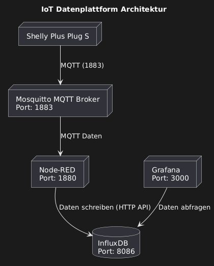

# IoT-Datenplattform für Strommonitoring (Docker-basiert)

Dieses Projekt erfasst, speichert und visualisiert Echtzeitdaten zum Stromverbrauch im Haushalt.  
Die Plattform basiert vollständig auf **Docker-Containern** und kombiniert mehrere Open-Source-Tools zu einer robusten IoT-Lösung.

## 🚀 Architektur



- **Shelly Plus Plug S**: Smarte WLAN-Steckdosen zur Messung von Stromverbrauch.
- **Homeserver**: Hosting aller Prozesse inkl. datenspeicherung.
- **Mosquitto (MQTT Broker)**: Empfang der Messdaten über das MQTT-Protokoll.
- **Node-RED**: Verarbeitung, Filterung und Weiterleitung der Daten.
- **InfluxDB**: Zeitreihendatenbank zur langfristigen Speicherung.
- **Grafana**: Interaktive Dashboards zur Visualisierung.

## 📦 Technologien & Komponenten

| Komponente | Aufgabe                        | Port (Standard) |
| ---------- | ------------------------------ | --------------- |
| Mosquitto  | MQTT Broker                    | 1883 (MQTT)     |
| Node-RED   | Logik- und Datenflusssteuerung | 1880            |
| InfluxDB   | Speicherung der Messwerte      | 8086            |
| Grafana    | Visualisierung & Dashboards    | 3000            |

## 🛠 Voraussetzungen

- Heimserver im lokalen Netzwerk
- **Docker** und **Docker Compose**
- Shelly Plus Plug S im lokalen Netzwerk
- Grundkenntnisse in Netzwerken (z. B. statische IPs, Portfreigaben)

## 📂 Projektstruktur

```text
.
├── docker-compose.yml # Startet alle Dienste
├── influxdb/
| └── Dockerfile
| └── init.sh # beim start der InfluxDb, wir Datenbank erstellt
├── mosquitto/
│ └── mosquitto.conf # MQTT-Broker-Konfiguration
├── nodered/
│ └── flows.json # Beispiel-Flow für MQTT → InfluxDB
└── README.md # Dieses Dokument
```

## ⚙️ Installation & Start

1. **Projekt klonen**
   ```bash
   https://github.com/Ra1n-42/IoT-Datenplattform.git
   cd IoT-Datenplattform
   ```
2. **Container starten**
   ```bash
   docker compose up -d
   ```

## Node-RED Flow importieren

1. Öffne die Datei `nodered/flows.json`.
2. Ersetze alle Vorkommen von `host-ip` mit der tatsächlichen IP-Adresse deines Servers/Hosts.
3. Importiere den Flow in Node-RED über das Menü → Import → Datei auswählen → `flows.json`.
4. Oder lege die Datei direkt in den Docker-Container unter `/data/flows.json` ab, dann lädt Node-RED den Flow automatisch beim Start.

## Grafana Datenquelle konfigurieren

1. Melde dich bei Grafana an: `http://<host-ip>:3000` (Standard: admin/admin).
2. Gehe zu **Configuration** → **Data Sources**.
3. Bearbeite die InfluxDB-Datenquelle.
4. Ersetze in der URL `http://host-ip:8086` mit der IP-Adresse deines Hosts.
5. Speichere die Änderungen.

## Grafana Dashboard hinzufügen / importieren

1. Öffne Grafana im Browser: `http://<host-ip>:3000`
2. Melde dich an (Standard: Benutzer `admin`, Passwort `admin`, dann Passwort ändern).
3. Klicke oben rechts auf den „NEW“-Knopf und wähle **Import**.
4. Lade die exportierte `.json`-Datei hoch oder füge den JSON-Code direkt ein.
5. Wähle die passende Datenquelle aus (z.B. deine InfluxDB-Instanz).
6. Klicke auf **Importieren**.

Das Dashboard sollte nun verfügbar sein.

## Zugriff auf Dienste

- Mosquitto: mqtt://<host-ip>:1883
- Node-RED: http://<host-ip>:1880
- InfluxDB: http://<host-ip>:8086
- Grafana: http://<host-ip>:3000 (Login: admin / admin, dann Passwort ändern!)

## 📡 Zusätzliche Hinweise zur Einrichtung der Shelly Plus Plug S

- **Statische IP-Adresse für den Host:**  
  Damit die Shelly-Geräte zuverlässig Daten an den MQTT-Server senden können, muss im Router (z. B. FritzBox) für den Host, auf dem Mosquitto läuft, eine feste IPv4-Adresse vergeben werden. So ändert sich die IP nicht und die Shelly-Geräte senden immer an die korrekte Adresse.

- **WLAN- und MQTT-Konfiguration in den Shelly-Geräten:**

  - WLAN-Zugangsdaten im Shelly eintragen und verbinden.
  - Unter „MQTT“ im Shelly-Interface die IP-Adresse des MQTT-Brokers (Host-IP) mit Port `1883` eintragen.
  - „Custom MQTT Präfix“ aktivieren und z. B. `shelly-test` eingeben, dann speichern.

- **🔐 Internetzugang der Shelly-Geräte sperren:**  
  Um zu verhindern, dass die Shelly-Geräte Daten außerhalb des lokalen Netzwerks senden („nach Hause telefonieren“), kann man im Router (z. B. FritzBox) den Internetzugang für die Shelly-Geräte sperren:

  - Router-Admin-Interface öffnen.
  - Shelly-Geräte in den Netzwerkverbindungen auswählen.
  - Bearbeiten und „Internetzugang sperren“ aktivieren.

- **💡 Nice to Know: Gerätekommunikation im Heimnetzwerk**

  Geräte in deinem lokalen Netzwerk (LAN), die über denselben Router verbunden sind, können direkt miteinander kommunizieren. Ein Befehl von deinem Smartphone an eine Shelly-Steckdose wird zum Router geschickt, der die Nachricht direkt an die Steckdose weiterleitet – alles bleibt lokal.

  Erst wenn ein Gerät eine Verbindung zu einer Adresse außerhalb deines Heimnetzwerks aufbauen will, versucht der Router, diese Anfrage über das Internet weiterzuleiten. Die "Internetzugang sperren"-Funktion deines Routers verhindert genau diesen Schritt und schützt so deine Geräte davor, Daten an externe Server zu senden.


